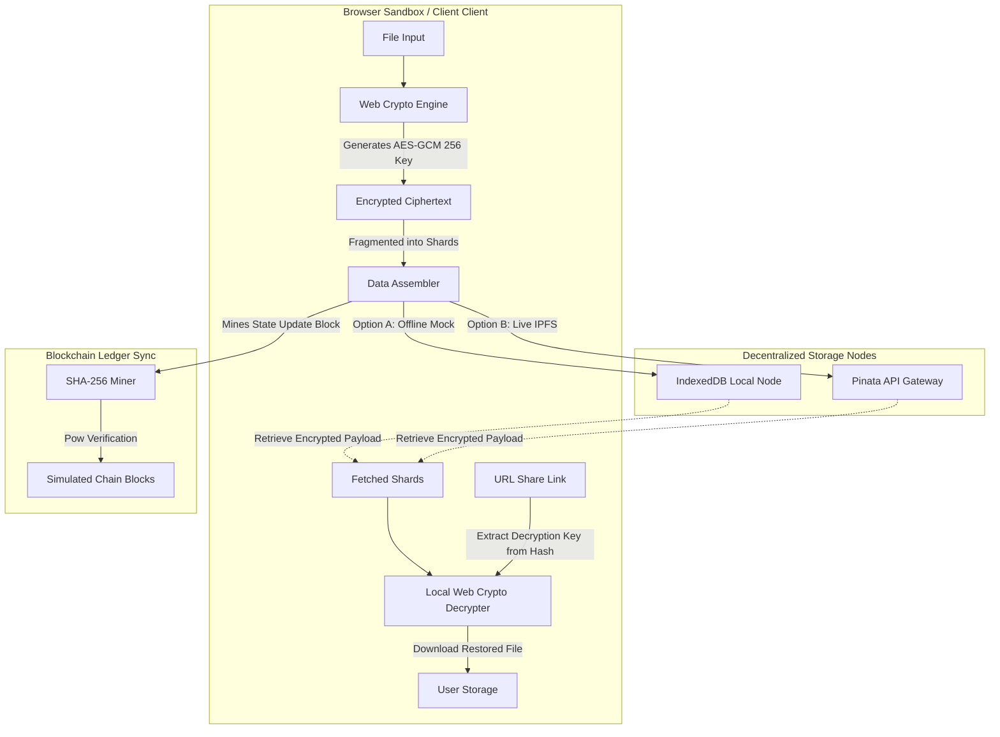

# 🛡️ ANON Dapp // Decentralized Zero-Knowledge Encryption Vault

> **ANON Dapp** is a futuristic, decentralized Web3 application designed for client-side encrypted file uploads, zero-knowledge link sharing, and local proof-of-work blockchain ledger sync.

Built with a gorgeous, high-performance **cyberpunk HUD design**, grid overlays, pulsing scanlines, and an interactive **WebGL/2D active peer connection backdrop**, it delivers a highly immersive cryptographic data management experience.

---

## 🚀 Key Features

*   **🔒 Browser-Side Cryptography**: Files are encrypted entirely inside the client browser using the native Web Crypto API (**AES-GCM 256-bit**). Your raw assets never touch the internet.
*   **🧩 Fragmented Sharding Animation**: Visualizes the encryption pipeline as it fragments ciphertext data streams into anonymous peer shards and dispatches them across the mesh.
*   **🔗 Zero-Knowledge (ZK) Share Links**: Generates sharing links where the decryption key and file metadata reside in the URL hash fragment (`/#/share/CID#key=...`). Since hash fragments are never sent to servers, sharing is completely private and peer-to-peer.
*   **⛓️ Mined Transaction Ledger**: Implements a simulated local blockchain registry using **SHA-256 Proof-of-Work**. Sending messages or uploading files triggers a real-time hashing process that "mines" the transaction into blocks.
*   **📡 Hybrid IPFS Integration**: Persists files locally in an IndexedDB node sandbox. Paste a **Pinata API JWT** in the config panel to seamlessly route uploads directly onto the global IPFS gateway networks!
*   **🎯 Interactive Radar Sweep**: A canvas-based telemetry scanner displaying active peer locations, response pings, and data jitter values.

---

## 📊 Architecture Diagram

The flowchart below demonstrates the zero-knowledge security cycle: from file ingestion and browser encryption to ledger mining and decentralized URL sharing.



---

## 🛠️ Technology Stack

*   **Core Framework**: [React 19](https://react.dev/) + [Vite 8](https://vite.dev/) (fast compiler and bundler)
*   **Styling Theme**: Custom Vanilla CSS (fluid neon glows, responsive cyber-grid HUD overlays)
*   **Decentralized Storage API**: IndexedDB (client DB) / Pinata PinFile API (IPFS pinning)
*   **Cryptography Engine**: Web Crypto API (native `window.crypto.subtle` digest/encrypt algorithms)
*   **Iconography**: Lucide React Icons
*   **Effects & Visuals**: Canvas Confetti (successful downloads) + custom HTML5 Canvas particle/radar systems

---

## ⚙️ How the Zero-Knowledge Link Sharing Works

1.  **Encryption**: When a file is uploaded, a high-entropy symmetric `CryptoKey` is synthesized. The file is encrypted with this key, and stored on IPFS.
2.  **Zero-Knowledge Key Encoding**: A shareable URL is compiled:
    `https://anon-dapp.net/#/share/<IPFS_CID>#key=<BASE64_KEY>&iv=<BASE64_IV>&name=<METADATA>`
3.  **Key Protection**: According to the W3C URI specification, characters following a `#` (the hash fragment) are **never sent to the hosting server** during HTTP requests.
4.  **Decryption**: When a peer clicks the share link, their browser fetches the ciphertext from IPFS using the public CID, grabs the decryption credentials directly from the local browser address bar hash, decrypts the binary stream in-memory, and prompts a local file download.

---

## 📦 Getting Started

### Prerequisites

*   [Node.js](https://nodejs.org/) (v20+ recommended)
*   npm (v10+ package manager)

### Installation

1.  Clone the repository:
    ```bash
    git clone https://github.com/grammerpro/ANON-Dapp.git
    cd ANON-Dapp
    ```

2.  Install dependencies:
    ```bash
    npm install
    ```

3.  Launch the local development server:
    ```bash
    npm run dev
    ```

4.  Open the address returned by Vite (usually `http://localhost:5173`) in your browser.

---

## 🛡️ License

This project is licensed under the MIT License - see the LICENSE file for details.
